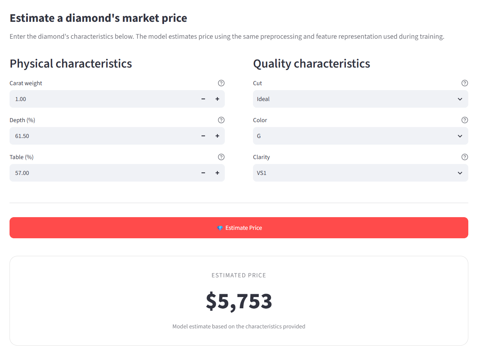

# 💎 Diamond Price Modeling

**Statistical Regression · Model Diagnostics · Interactive ML Application**

> An end-to-end statistical modeling project that investigates the drivers of diamond prices, addresses multicollinearity and non-linearity, and deploys the final model as an interactive price estimator.

### 🚀 Live Demo

**[💎 Try the Diamond Rate Estimator](https://diamond-rate-estimator.streamlit.app/)**

### 📊 Results

**97.94% held-out R²** · **$449.92 Test MAE** · **43,133 training observations** · **10,784 test observations**
## 🖥️ Application Preview



---

## 🚀 Live Demo

**Interactive Diamond Price Estimator:**
[Live Streamlit App](https://diamond-rate-estimator.streamlit.app/)

The application allows users to enter diamond characteristics and receive an estimated price, while also exploring model performance, diagnostics, and methodology.

---

## 🎯 Project Objective

The goal of this project is to understand how physical and quality characteristics of diamonds relate to their market price and build an interpretable statistical model capable of producing useful price estimates.

The analysis uses the Seaborn Diamonds dataset containing approximately **54,000 diamond observations**.

The project addresses questions such as:

* How strongly does carat influence price?
* Are the relationships between diamond characteristics and price linear?
* What problems arise from correlated physical dimensions?
* Does transforming price and carat improve the regression?
* How well does the final model generalize to unseen data?
* Can the statistical model be packaged into a practical prediction application?

---

## 📊 Key Results

The final model uses a **log-log OLS regression**:

```text
log(price) ~ log(carat) + cut + color + clarity + depth + table
```

### Held-out test performance

| Metric                |      Result |
| --------------------- | ----------: |
| Training observations |      43,133 |
| Test observations     |      10,784 |
| Test R² — log scale   |  **0.9794** |
| Test MAE              | **$449.92** |
| Smearing correction   |  **1.0107** |
| Train/test split      |     80 / 20 |
| Random state          |          42 |

The model explains approximately **97.94% of the variance in log diamond prices on the held-out test set**, with an average absolute prediction error of approximately **$450** after transforming predictions back to dollar values.

> **Note:** R² is reported on the log-price scale, while MAE is reported in original dollar units.

---

## 🔍 Why Log-Log Regression?

The initial regression analysis revealed several issues with a straightforward linear model.

### 1. Multicollinearity

The physical dimensions `x`, `y`, and `z` are strongly related to `carat`.

Including all of them simultaneously can make coefficient estimates unstable and makes interpretation more difficult.

The analysis therefore explored alternative predictor combinations rather than blindly keeping every available feature.

### 2. Non-linearity

Diamond price does not increase proportionally with carat.

A larger diamond can command a disproportionately higher price, meaning a simple linear relationship between carat and price is not an ideal representation of the data.

Applying logarithmic transformations to both variables provides a more appropriate functional form:

```text
log(price) ~ log(carat)
```

### 3. Heteroscedasticity

The spread of prediction errors changes across the range of diamond prices.

The log transformation helps stabilize the variance and produces a substantially better-fitting regression model.

---

## 🧪 Model Comparison

The original analysis compared three regression specifications:

| Model       | Description                          |         R² |         MAE |
| ----------- | ------------------------------------ | ---------: | ----------: |
| Model A     | Drop `x/y/z`, retain `carat`         |     0.9044 |     $854.01 |
| Model B     | Alternative predictor combination    |     0.9054 |     $850.92 |
| **Model C** | **Log-price / log-carat regression** | **0.9792** | **$459.02** |

These figures are from the original full-dataset model comparison in the exploratory notebook and are **not held-out test metrics**.

The final train/test evaluation subsequently produced:

> **Test R² = 0.9794 · Test MAE = $449.92**

This provides a more appropriate benchmark for the deployed model.

---

## 🧠 Final Model

The deployed model is an Ordinary Least Squares (OLS) regression fitted on the following transformed and encoded features:

### Numerical features

* `log(carat)`
* `depth`
* `table`

### Ordinal categorical features

**Cut**

```text
Fair → 0
Good → 1
Very Good → 2
Premium → 3
Ideal → 4
```

**Color**

```text
J → 0
I → 1
H → 2
G → 3
F → 4
E → 5
D → 6
```

**Clarity**

```text
I1 → 0
SI2 → 1
SI1 → 2
VS2 → 3
VS1 → 4
VVS2 → 5
VVS1 → 6
IF → 7
```

The final model therefore uses:

```text
log(carat)
cut
color
clarity
depth
table
```

---

## 💰 Returning Predictions to Dollar Values

Because the model predicts:

```text
log(price)
```

its predictions need to be transformed back to the original price scale.

Simply applying:

```python
np.exp(predicted_log_price)
```

can introduce retransformation bias.

The project therefore applies a **smearing correction** estimated from the training residuals:

```python
correction_factor = np.mean(np.exp(model.resid))
```

The final price estimate is calculated as:

```python
predicted_price = np.exp(predicted_log_price) * correction_factor
```

For the current trained model, the correction factor is approximately:

```text
1.0107
```

---

## 📈 Model Diagnostics

The application includes visual diagnostics generated from the held-out test data.

### Actual vs Predicted Price

Shows how closely the model's predictions track observed diamond prices.

### Prediction Error Distribution

Shows the distribution of errors produced by the model on unseen observations.

### Price vs Carat

Visualizes the underlying non-linear relationship between diamond carat and price.

These diagnostics are available directly in the application's **Model Insights** section.

---

## 🖥️ Interactive Application

The project includes a Streamlit application with three main sections.

### 💎 Price Estimator

Users can enter:

* Carat
* Cut
* Color
* Clarity
* Depth
* Table

The application then generates an estimated diamond price using the saved statistical model.

### 📊 Model Insights

Displays:

* Held-out test performance
* Model comparison
* Actual vs predicted visualization
* Prediction error distribution
* Price vs carat relationship
* Model validation details

### 🔬 Methodology

Explains the complete modeling workflow:

```text
Raw Data
   ↓
Data Cleaning
   ↓
Exploratory Data Analysis
   ↓
Feature Encoding
   ↓
Baseline Regression
   ↓
Model Diagnostics
   ↓
Log Transformation
   ↓
Train/Test Evaluation
   ↓
Smearing Correction
   ↓
Saved Model
   ↓
Streamlit Application
```

---

## 🗂️ Project Structure

```text
diamonds-price-prediction/
│
├── app/
│   └── app.py
│
├── src/
│   ├── __init__.py
│   ├── preprocessing.py
│   ├── train.py
│   └── predict.py
│
├── models/
│   ├── diamond_price_model.pkl
│   └── model_metadata.json
│
├── data/
│   └── diamonds.csv
│
├── notebooks/
│   └── diamonds_price_prediction.ipynb
│
├── outputs/
│   ├── actual_vs_predicted.png
│   ├── prediction_errors.png
│   └── price_vs_carat.png
│
├── test_prediction.py
├── requirements.txt
├── README.md
└── LICENSE
```

---

## ⚙️ Installation

Clone the repository:

```bash
git clone https://github.com/OmAditya19/diamonds-price-prediction.git

cd diamonds-price-prediction
```

Create a virtual environment:

```bash
python -m venv .venv
```

Activate it.

### Windows

```bash
.venv\Scripts\activate
```

### macOS / Linux

```bash
source .venv/bin/activate
```

Install dependencies:

```bash
pip install -r requirements.txt
```

---

## ▶️ Train the Model

Training is separated from the application so that the Streamlit app does not retrain the model every time it starts.

Run:

```bash
python -m src.train
```

This will:

1. Load and clean the dataset
2. Prepare model features
3. Split the data into training and testing sets
4. Fit the OLS regression
5. Evaluate the model on the held-out test set
6. Calculate the smearing correction
7. Save the trained model
8. Save model metadata
9. Generate diagnostic plots

The resulting artifacts are stored in:

```text
models/
outputs/
```

---

## 🧪 Test a Prediction

A simple prediction test can be run with:

```bash
python test_prediction.py
```

Example input:

```text
Carat: 1.0
Cut: Ideal
Color: G
Clarity: VS1
Depth: 61.5
Table: 57.0
```

Example output:

```text
Predicted price: $5,753.35
```

---

## 🌐 Run the Streamlit Application

From the project root:

```bash
streamlit run app/app.py
```

The application will open in your browser.

---

## ⚠️ Limitations

This model is intended as an **educational and portfolio demonstration**, not as a professional diamond appraisal system.

The dataset does not contain several potentially important pricing variables, such as:

* Certification body
* Fluorescence
* Retail channel
* Natural vs laboratory-grown status
* Other gemological characteristics

The current implementation also uses ordinal encoding for categorical variables. While this keeps the statistical model compact and interpretable, one-hot encoding or more flexible modeling approaches could capture categorical effects differently.

The reported MAE should also not be interpreted as a guaranteed error bound for an individual prediction.

---

## 🔮 Future Improvements

Potential extensions include:

* One-hot encoding of categorical variables
* Interaction terms
* Gamma GLM or other generalized linear models
* Tree-based models such as Random Forest or Gradient Boosting
* Hyperparameter tuning and cross-validation
* Prediction intervals
* More comprehensive residual diagnostics
* Additional gemological and certification features
* Comparison of statistical and machine-learning approaches
* Improved uncertainty estimation

The goal would be to determine whether more flexible models can improve predictive performance **without sacrificing interpretability unnecessarily**.

---

## 🛠️ Tech Stack

* **Python**
* **Pandas**
* **NumPy**
* **Statsmodels**
* **Scikit-learn**
* **Matplotlib**
* **Seaborn**
* **Streamlit**
* **Jupyter Notebook**

---

## 📚 What This Project Demonstrates

This project demonstrates an end-to-end data science workflow:

* Exploratory data analysis
* Data cleaning
* Feature engineering
* Categorical encoding
* Regression modeling
* Multicollinearity diagnosis
* Heteroscedasticity diagnosis
* Log transformations
* Train/test validation
* Retransformation using smearing correction
* Model evaluation
* Model persistence
* Interactive application development
* Data visualization

The main takeaway is not simply that a regression model can predict diamond prices.

It is that **model selection should follow an understanding of the data and its statistical behavior**.

---

## 📄 License

This project is licensed under the MIT License.

---

## 👤 Author

**Om Aditya**

GitHub: `https://github.com/OmAditya19`

---

> **Disclaimer:** This application provides model-based estimates for educational purposes. It is not a professional diamond appraisal or valuation service.
