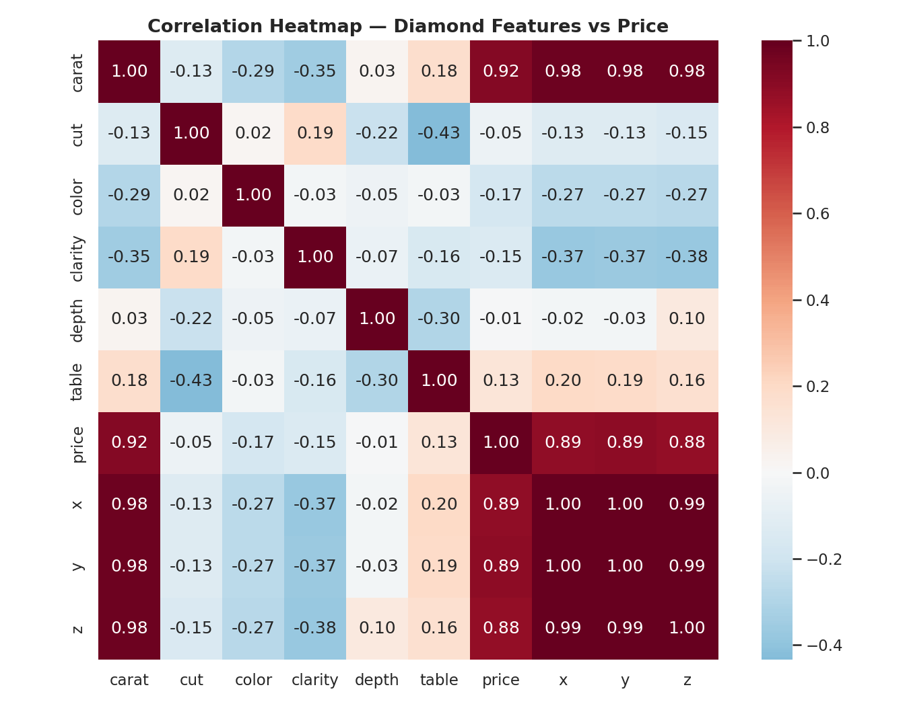
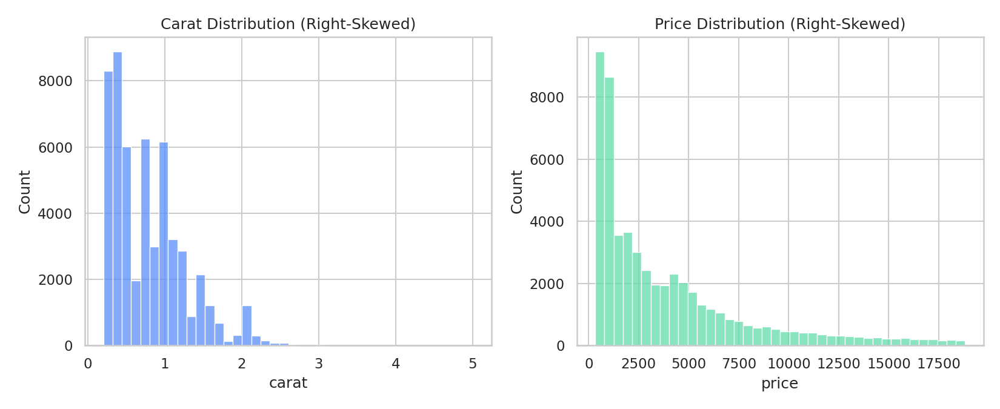
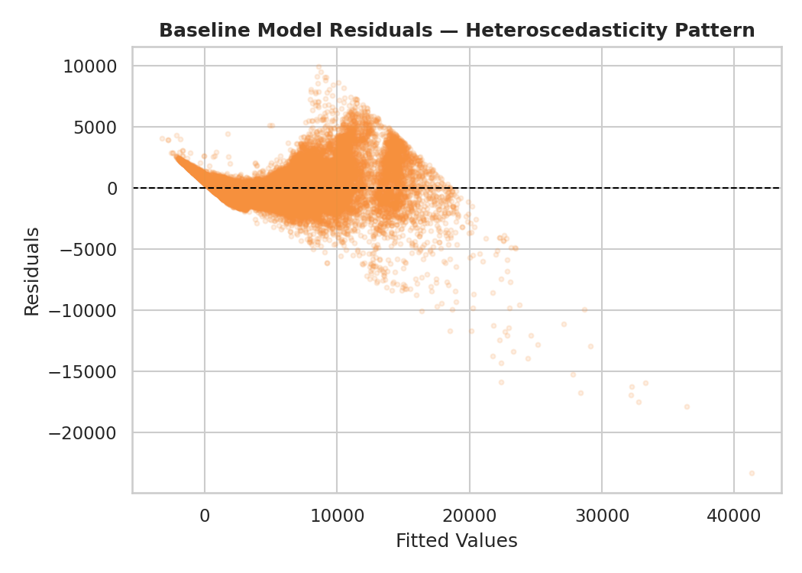
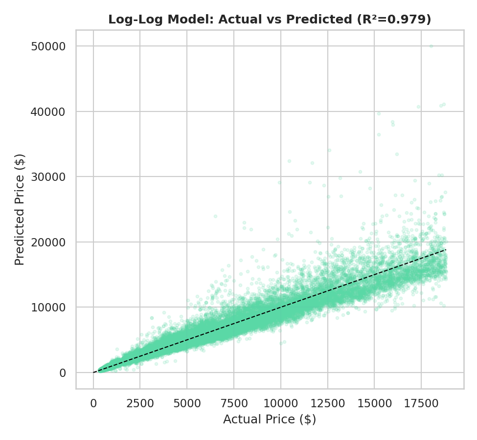

# Diamonds Price Prediction 💎

Statistical modeling project analyzing the **Seaborn Diamonds dataset** (~53,940 observations) to
understand what drives diamond prices and to build a reliable regression model for predicting price
from a diamond's physical and quality attributes.

## Project Overview

Diamond pricing depends on a mix of physical measurements (carat weight, dimensions) and
quality grades (cut, color, clarity). This project explores those relationships through
exploratory data analysis, correlation analysis, and multiple regression models — comparing a
domain-driven feature-selection approach against a log-log transformed model to address
multicollinearity, heteroscedasticity, and non-linearity in the price data.

**Key result:** a log-log transformed regression model achieves an R² of ~0.979, roughly halving
the mean absolute error compared to standard linear models fit on the raw price scale.

## Preview

| Correlation Heatmap | Feature Distributions |
|---|---|
|  |  |

| Baseline Model Residuals | Final Model: Actual vs Predicted |
|---|---|
|  |  |

## Dataset

| | |
|---|---|
| **Source** | [Seaborn diamonds dataset](https://github.com/mwaskom/seaborn-data/blob/master/diamonds.csv) |
| **Observations** | ~53,940 |
| **Features** | `carat`, `cut`, `color`, `clarity`, `depth`, `table`, `x`, `y`, `z` |
| **Target** | `price` |

The raw CSV is included at [`data/diamonds.csv`](data/diamonds.csv).

## Repository Structure

```
diamonds-price-prediction/
├── README.md
├── requirements.txt
├── .gitignore
├── data/
│   └── diamonds.csv
├── notebooks/
│   └── diamonds_price_prediction.ipynb
└── outputs/
    └── (exported figures, if any)
```

## Methodology

**Part 1 — Data Exploration & Preparation**
- Descriptive statistics and distribution plots for all numerical and categorical features
- Correlation analysis between predictors and price
- Data quality checks: identified and removed rows with impossible zero dimensions and extreme
  measurement-error outliers (e.g. a width recorded at 58.9mm)
- Ordinal encoding of `cut`, `color`, and `clarity`, justified by their natural quality hierarchy

**Part 2 — Model Development & Validation**
- Baseline OLS regression using all available features
- Diagnosed severe multicollinearity between carat and the physical dimensions (`x`, `y`, `z`),
  and heteroscedasticity/non-linearity in the residuals
- Compared three modeling strategies:
  - **Model A** — domain-driven feature selection (drop `x`, `y`, `z`, keep `carat`)
  - **Model B** — alternative predictor combination
  - **Model C** — log-log transformation of price and carat
- Evaluated models using R², and real-dollar Mean Absolute Error (with smearing correction for
  the log-transformed model)
- Selected Model C (log-log) as the best-performing and best-behaved model

**Part 3 — Interpretation & Insights**
- Diamond prices scale non-linearly with carat (a "carat power law"), which linear models on the
  raw price scale cannot capture
- Practical implications for automated appraisal tools, limitations of the analysis, and
  recommendations for additional data (e.g. certification body, fluorescence, retail channel) that
  could further improve predictive accuracy

## How to Run

```bash
git clone <your-repo-url>
cd diamonds-price-prediction
pip install -r requirements.txt
jupyter notebook notebooks/diamonds_price_prediction.ipynb
```

## Author

M V K Om Aditya — M.Sc. Data Science & AI
